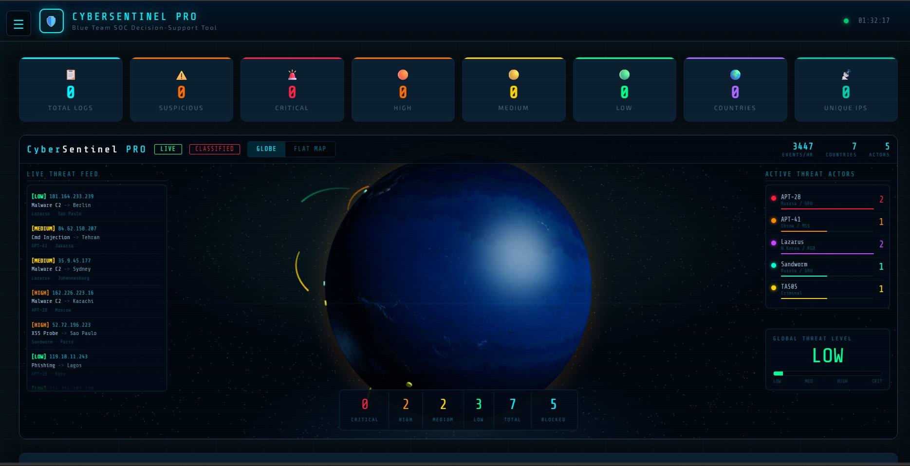
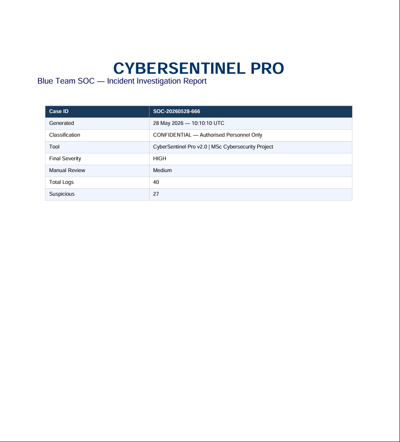

# CyberSentinel Pro — Blue Team SOC Analyst Tool

CyberSentinel Pro is a Python Flask-based blue-team SOC analyst tool for analysing security logs, detecting suspicious activity, mapping findings to MITRE ATT&CK, generating interactive dashboards, and exporting a professional incident report as PDF.

## Features

- Upload or paste `.log`, `.txt`, `.csv`, or `.json` security logs
- Detect suspicious events such as brute force, port scanning, SQL injection, XSS, ransomware, malware/C2, DDoS, privilege escalation, phishing, and path traversal
- Severity scoring for low, medium, high, and critical alerts
- MITRE ATT&CK tactic and technique mapping
- Optional OpenAI-powered SOC analysis and executive summary
- Built-in fallback analysis when no API key is configured
- Interactive Plotly charts and dashboard UI
- Source IP, country, attack type, and timeline analytics
- Professional PDF incident report export
- Optional ngrok public URL support

## Project Structure

```text
CyberSentinel-Pro/
├── cybersentinel_pro.py
├── requirements.txt
├── README.md
├── LICENSE
├── .gitignore
├── .env.example
├── SECURITY.md
└── samples/
    └── sample_security_logs.txt
```

## Installation

### 1. Clone the repository

```bash
git clone https://github.com/ritik19coder/CyberSentinel-Pro.git
cd CyberSentinel-Pro
```

### 2. Create and activate a virtual environment

Windows PowerShell:

```powershell
python -m venv .venv
.\.venv\Scripts\Activate.ps1
```

Command Prompt:

```cmd
python -m venv .venv
.venv\Scripts\activate
```

Linux/macOS:

```bash
python3 -m venv .venv
source .venv/bin/activate
```

### 3. Install dependencies

```bash
pip install -r requirements.txt
```

### 4. Optional: configure API keys

Copy `.env.example` to `.env` and add your own keys if required:

```bash
cp .env.example .env
```

Required only for AI analysis:

```text
OPENAI_API_KEY=your_openai_api_key_here
```

Required only for public ngrok URL:

```text
NGROK_AUTHTOKEN=your_ngrok_token_here
```

The tool still works without these keys using built-in rule-based and CVE fallback analysis.

## Usage

Run the tool:

```bash
python cybersentinel_pro.py
```

Open in your browser:

```text
http://localhost:5000
```

Then upload a log file or paste raw logs. You can test using:

```text
samples/sample_security_logs.txt
```

## Important Notes

- Do not upload real sensitive logs to a public repository.
- Do not commit API keys or ngrok tokens.
- AI output is advisory only. A human analyst should verify all findings before taking action.
- This project is for defensive cybersecurity learning and SOC analysis.

## Screenshot Placeholder

Add your screenshots here after pushing to GitHub:


## Screenshots

### Dashboard


### PDF Report


## Future Improvements

- Add authentication for analyst login
- Store past investigations in SQLite
- Add real GeoIP lookup instead of demo country mapping
- Add Sigma/YARA rule support
- Add Docker support
- Add unit tests for parser and severity scoring

## Author

**Ritik Chauhan**  
GitHub: [@ritik19coder](https://github.com/ritik19coder)

## Licence

This project is licensed under the MIT Licence. See the [LICENSE](LICENSE) file for details.
